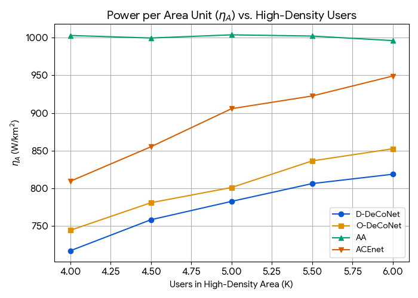
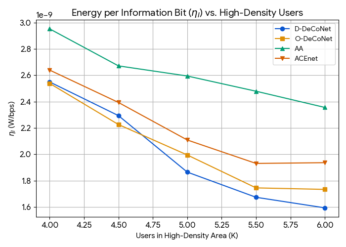

# گزارش پیاده‌سازی و تحلیل نتایج الگوریتم‌های مدیریت وضعیت ایستگاه‌های پایه

## ۱. مقدمه و هدف پروژه
هدف این پروژه پیاده‌سازی و تحلیل عملکرد چهار الگوریتم مدیریت وضعیت ایستگاه‌های پایه (BS) در شبکه‌های سلولی اینترنت اشیا با استفاده از داده‌های شبیه‌سازی‌شده است. این الگوریتم‌ها شامل:

- **AA (All Active)**
- **ACEnet**
- **O-DeCoNet (OPTICS-Based)**
- **D-DeCoNet (DBSCAN-Based)**

می‌باشد. دو ‫پارامتر‬ اصلی برای ارزیابی عملکرد این الگوریتم‌ها در نظر گرفته شده:

- **ηₐ**: توان مصرفی به ازای واحد مساحت (W/km²)
- **ηᵢ**: انرژی مصرفی به ازای هر بیت اطلاعات (J/Mbit)

---

## ۲. مروری بر الگوریتم‌ها

### ۲.۱. الگوریتم AA
در این روش تمامی BS ها در وضعیت فعال قرار دارند. این روش ساده بوده ولی مصرف انرژی بالایی دارد.

### ۲.۲. الگوریتم ACEnet
در این روش هر کاربر به نزدیک‌ترین BS متصل شده و BSهایی که کاربری ندارند به وضعیت خواب می‌روند.

### ۲.۳. الگوریتم O-DeCoNet
این روش بر اساس خوشه‌بندی OPTICS پیاده‌سازی شده است. کاربران در خوشه‌های با تراکم بالا شناسایی شده و سپس با استفاده از پارامتر شعاع کاهش (Thinning Radius)، برخی از BSها به وضعیت خواب می‌روند.

### ۲.۴. الگوریتم D-DeCoNet
مشابه O-DeCoNet است اما به جای OPTICS از DBSCAN برای خوشه‌بندی استفاده می‌کند.

---

## ۳. پیاده‌سازی

### ۳.۱. تولید شبکه (`generate_network.py`)
این ماژول مسئول تولید موقعیت BSها و کاربران است. پارامترهایی نظیر اندازه ناحیه، تعداد BSها، تعداد کاربران با تراکم بالا و پایین، و شعاع ناحیه‌های با تراکم بالا قابل تنظیم هستند.

### ۳.۲. خوشه‌بندی (`optics_clustering.py` و `dbscan_clustering.py`)
- **OPTICS**: خوشه‌بندی با استفاده از پارامترهای `min_pts` و `xi`.
- **DBSCAN**: خوشه‌بندی با پارامترهای `eps` و `min_pts`.

### ۳.۳. کنترل وضعیت BS (`bs_mode_control.py`)
- محاسبه شعاع کاهش بر اساس اندازه خوشه و ظرفیت BSها (μB=100).
- انتخاب BSهای فعال به‌گونه‌ای که اتصال کاربران حفظ شود.

### ۳.۴. محاسبه معیارها  

$$
\eta_A = \frac{N_{\text{AWAKE}} \times P_B}{A}
$$

  
$$
P_B = \frac{P_{\text{tx}}}{\sigma} + P_c + P_o
$$  

- $N_{\text{AWAKE}}$: تعداد ایستگاه‌های پایه فعال  
- $P_{\text{tx}}$: توان ارسال  
- $\sigma$: بازده تقویت‌کننده  
- $P_c$: توان مدار  
- $P_o$: توان آماده‌به‌کار  
- $A$: مساحت پوشش (km²)  

---

$$
\eta_I = \frac{P_{\text{total}}}{R_{\text{total}}}
$$  

 
$$
P_{\text{total}} = N_{\text{AWAKE}} \times P_B
$$  
$$
R_{\text{total}} = \sum_{i=1}^{N_{\text{AWAKE}}} \sum_{u \in U_i} \left( \frac{B}{N_i} \cdot \log_2(1 + \text{SINR}_{u}) \right)
$$  

- $U_i$: مجموعه کاربران متصل به BS شماره $i$  
- $N_i$: تعداد کاربران متصل به BS شماره $i$  
- $B$: پهنای باند کل برای هر BS (Hz)  
- $\text{SINR}_u$: نسبت سیگنال به نویز و تداخل برای کاربر $u$  

---

## ۴. نتایج و تحلیل

### ۴.۱. نتایج ηₐ




- الگوریتم AA: مقدار ثابت و بالا (~۳۳۵۰ W/km²)
- الگوریتم ACEnet: از مقدار کم شروع شده و با افزایش K به مقدار AA نزدیک می‌شود.
- الگوریتم‌های O-/D-DeCoNet: مقدار ثابت و پایین (~۱۴۵۰ W/km²) به دلیل کنترل مؤثر BSها.

### ۴.۲. نتایج ηᵢ



- الگوریتم AA: مقدار بالا در K کم و کاهش تدریجی با افزایش K.
- الگوریتم ACEnet: مقدار متوسط با روند تقریباً ثابت.
- الگوریتم‌های O-/D-DeCoNet: مقدار بسیار پایین و ثابت، نشان‌دهنده کارایی انرژی بالا.

---

## ۵. خوشه‌بندی و وضعیت BSها

### ۵.۱. خروجی D-DeCoNet


در این خروجی، خوشه‌ها به رنگ‌های متفاوت و BSها با رنگ سبز (فعال) و قرمز (خواب) نمایش داده شده‌اند.

### ۵.۲. خروجی O-DeCoNet


مشابه D-DeCoNet اما با خوشه‌بندی OPTICS.

---
# راهنمای اجرای شبیه‌سازی‌ها و رسم نمودارها

در این پروژه، با استفاده از **Makefile** می‌توانید به راحتی شبیه‌سازی‌ها را اجرا کرده و خروجی‌های مختلف را مشاهده کنید.

## دستورات موجود

- **رسم η_A (توان بر واحد مساحت):**
```bash
make etaA
```

- **رسم η_I (انرژی بر بیت اطلاعات):**
```bash
make etaI
```

- **رسم همزمان η_A و η_I:**
```bash
make both
```

- **نمایش خوشه‌های الگوریتم D-DeCoNet برای مقدار مشخص K:**
```bash
make viz-d K=<تعداد_کاربران> RNG=<عدد_تصادفی>
```
به طور پیش‌فرض:
```bash
make viz-d K=6000 RNG=123
```

- **نمایش خوشه‌های الگوریتم O-DeCoNet برای مقدار مشخص K:**
```bash
make viz-o K=<تعداد_کاربران> RNG=<عدد_تصادفی>
```
به طور پیش‌فرض:
```bash
make viz-o K=6000 RNG=123
```

- **پاک کردن کش‌ها و فایل‌های موقت:**
```bash
make clean
```
---


## ۶. جمع‌بندی
- الگوریتم‌های DeCoNet (چه با OPTICS و چه با DBSCAN) نسبت به AA و ACEnet مصرف انرژی بسیار کمتری دارند.
- ACEnet در شرایط تراکم کاربری پایین کارایی خوبی دارد اما با افزایش کاربران، مصرف انرژی آن به AA نزدیک می‌شود.
- معیار ηᵢ نشان می‌دهد که DeCoNet‌ها در بهره‌وری انرژی بسیار برترند.

---

## ۷. مرجع

این پروژه و ارزیابی آن بر اساس مقاله زیر انجام شده است:

**W. Lee, B. C. Jung, and H. Lee**, "DeCoNet: Density Clustering-Based Base Station Control for Energy-Efficient Cellular IoT Networks," *IEEE Access*, vol. 8, pp. 121820–121832, 2020, doi:[10.1109/ACCESS.2020.3006522](https://doi.org/10.1109/ACCESS.2020.3006522).

